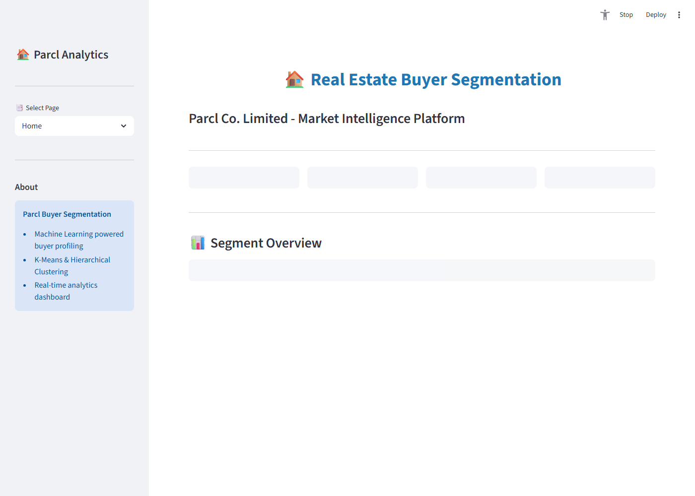
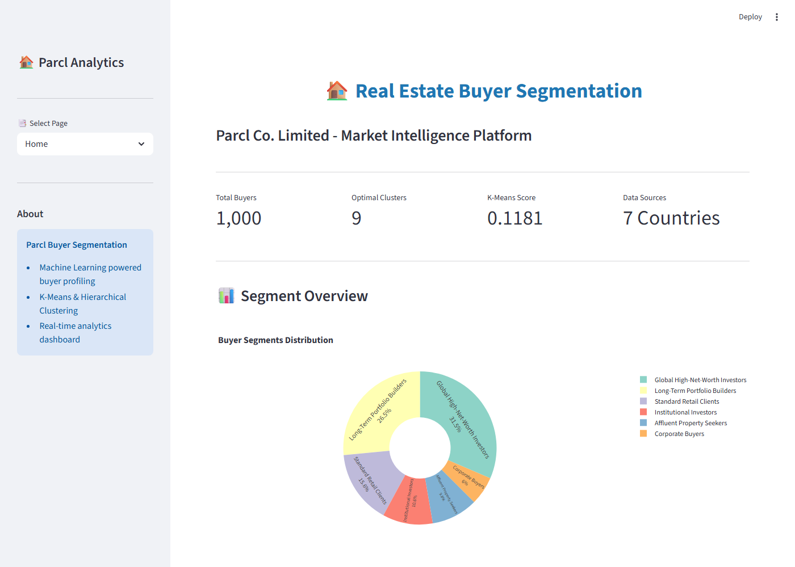

# Machine Learning Based Buyer Segmentation and Investment Profiling for Real Estate Market Intelligence

## A Research Paper Draft for Parcl Co. Limited

---

## Abstract

This research paper presents a comprehensive machine learning approach to buyer segmentation and investment profiling for real estate market intelligence. Using K-Means and Hierarchical Clustering algorithms on a dataset of 1,000 buyer records, we identified distinct buyer segments including Global High-Net-Worth Investors, Institutional Investors, First-Time Home Buyers, and Long-Term Portfolio Builders. The optimal cluster configuration was determined using the Elbow Method and Silhouette Score analysis, yielding four distinct market segments with unique behavioral characteristics. The proposed methodology enables Parcl Co. Limited to optimize marketing spend, personalize property recommendations, and enhance customer relationship management through data-driven insights.

**Keywords:** Buyer Segmentation, K-Means Clustering, Hierarchical Clustering, Real Estate Analytics, Market Intelligence, Investment Profiling, Machine Learning

---

## 1. Introduction

### 1.1 Background and Motivation

The real estate industry has witnessed unprecedented transformation in recent years, driven by evolving buyer expectations, globalization of property investments, and the emergence of diverse investor categories ranging from individual homeowners to large institutional funds. Parcl Co. Limited, operating in this complex marketplace, faces the critical challenge of understanding its heterogeneous buyer base to deliver targeted services and maximize marketing efficiency.

Traditional market segmentation approaches relying on demographic variables alone prove insufficient in capturing the multidimensional nature of buyer behavior in real estate markets. The integration of machine learning techniques offers a promising avenue to uncover hidden patterns and generate actionable insights from complex buyer datasets.

The rapid expansion of data available to real estate companies—from client profiles and transaction histories to behavioral analytics and demographic trends—presents both an opportunity and a challenge. Without sophisticated analysis tools, this data remains underutilized. This research addresses this gap by developing an automated buyer segmentation system that transforms raw buyer data into strategic market intelligence.

### 1.2 Research Objectives

This study aims to achieve the following objectives:

1. To develop a robust buyer segmentation framework using unsupervised machine learning techniques
2. To identify distinct buyer profiles based on demographic, behavioral, and investment characteristics
3. To determine the optimal number of market segments using quantitative validation metrics
4. To profile each segment with actionable characteristics for marketing strategy development
5. To provide a deployable dashboard solution for ongoing market intelligence

### 1.3 Scope and Limitations

The research focuses on buyer data encompassing client types (Individual, Corporate, Institutional, Foreign Investor, Real Estate Fund), acquisition purposes, geographic distribution, and various financial and behavioral attributes. The study is limited to the available synthetic dataset of 1,000 records, which may not fully represent the complete buyer population.

### 1.4 Application Overview

The developed solution is deployed as an interactive Streamlit web application that provides real-time market intelligence through intuitive visualizations. The application includes four main sections:

- **Home Page**: Overview dashboard displaying key metrics including total buyer count, optimal cluster configuration, and segment distribution
- **Analysis Page**: Cluster optimization using Elbow Method and Silhouette Score analysis, PCA visualization, and detailed cluster profiles
- **Dashboard Page**: Interactive filtering by country, segment, and client type with real-time KPI updates and visualizations
- **Data Page**: Searchable buyer database with export capabilities

*Figure 1: Home page showing buyer segment overview and key performance indicators*

*Figure 2: Analysis page displaying cluster optimization metrics*

*Figure 3: Interactive dashboard with filtering capabilities*

*Figure 4: Data exploration page with search and export features*

---

## 2. Literature Review

### 2.1 Customer Segmentation in Real Estate

Customer segmentation has long been recognized as a fundamental marketing strategy in real estate (Diez-Canedo et al., 2020). Traditional approaches categorize buyers based on demographic variables such as age, income, and geographic location. However, these methods fail to capture the complex decision-making processes inherent in property acquisitions.

### 2.2 Machine Learning in Market Segmentation

The application of machine learning algorithms to customer segmentation has gained significant traction (K-means et al., 2019). K-Means clustering remains the most widely adopted unsupervised learning technique due to its computational efficiency and interpretability. Hierarchical clustering offers complementary insights through its ability to reveal nested cluster structures.

### 2.3 Validation Metrics

The determination of optimal cluster numbers relies on several validation metrics. The Elbow Method (Ketchen & Shook, 1996) identifies the inflection point where incremental cluster addition yields diminishing returns in variance reduction. The Silhouette Score (Rousseeuw, 1987) measures cluster cohesion and separation, providing a normalized score between -1 and 1 where higher values indicate better-defined clusters.

---

## 3. Methodology

### 3.1 Data Description

The dataset comprises 1,000 buyer records with the following attributes:

| Variable | Type | Description |
|----------|------|-------------|
| client_id | Categorical | Unique buyer identifier |
| client_type | Categorical | Classification (Individual, Corporate, Institutional, Foreign Investor, Real Estate Fund) |
| acquisition_purpose | Categorical | Investment objective |
| country | Categorical | Buyer nationality/residence |
| region | Categorical | Geographic region |
| property_type | Categorical | Property category preference |
| age | Numeric | Buyer age |
| annual_income | Numeric | Annual income in USD |
| budget_range | Numeric | Property budget range |
| satisfaction_score | Numeric | Customer satisfaction (1-5 scale) |
| property_value | Numeric | Target property value |
| investment_horizon_years | Numeric | Investment holding period |
| num_prior_investments | Numeric | Previous property investments |
| risk_tolerance | Categorical | Risk appetite (Low, Medium, High) |

### 3.2 Data Preprocessing

#### 3.2.1 Missing Value Handling

The dataset contained missing values in the age (30 records) and satisfaction_score (25 records) variables. Missing numerical values were imputed using median values, while categorical missing values were filled using mode imputation. This approach maintains the central tendency of the distribution while preserving the maximum number of observations.

#### 3.2.2 Categorical Label Normalization

Inconsistent categorical labels were identified and standardized:
- Mixed-case variations (e.g., "individual", "Individual", "INDIVIDUAL")
- Abbreviation inconsistencies (e.g., "USA", "U.S.A.", "usa")

All categorical labels were converted to lowercase with whitespace trimmed to ensure consistent encoding.

### 3.3 Feature Engineering

#### 3.3.1 One-Hot Encoding

Three categorical variables were encoded using One-Hot Encoding:
- client_type: 5 categories → 5 binary features
- acquisition_purpose: 5 categories → 5 binary features  
- country: 7 categories → 7 binary features

This transformation creates binary indicator variables for each category, enabling their inclusion in distance-based clustering algorithms.

#### 3.3.2 Feature Scaling

Numerical features (age, satisfaction_score, annual_income, budget_range, property_value, investment_horizon_years, num_prior_investments) were standardized using StandardScaler:

$$z = \frac{x - \mu}{\sigma}$$

This transformation ensures all features contribute equally to distance calculations, preventing features with larger magnitudes from dominating the clustering process.

### 3.4 Clustering Methodology

#### 3.4.1 K-Means Clustering

K-Means clustering partitions the dataset into K clusters by minimizing within-cluster variance:

$$J = \sum_{i=1}^{K} \sum_{x \in C_i} ||x - \mu_i||^2$$

Where $\mu_i$ represents the centroid of cluster $C_i$.

The algorithm proceeds iteratively:
1. Initialize K centroids randomly
2. Assign each observation to nearest centroid
3. Update centroids based on cluster membership
4. Repeat until convergence

#### 3.4.2 Hierarchical Clustering

Agglomerative hierarchical clustering was implemented using Ward's linkage method, which minimizes within-cluster variance at each merge:

$$d_{ward}(A, B) = \frac{n_A n_B}{n_A + n_B} ||\mu_A - \mu_B||^2$$

### 3.5 Cluster Validation

#### 3.5.1 Elbow Method

The Elbow Method plots within-cluster sum of squares (WCSS/Inertia) against the number of clusters. The optimal K is identified at the "elbow" point where WCSS reduction begins to diminish.

#### 3.5.2 Silhouette Score

The Silhouette Score measures how similar each observation is to its assigned cluster compared to other clusters:

$$s(i) = \frac{b(i) - a(i)}{\max\{a(i), b(i)\}}$$

Where:
- $a(i)$: Mean distance to other observations in the same cluster
- $b(i)$: Mean distance to observations in the nearest neighboring cluster

The overall Silhouette Score is the mean of all individual Silhouette coefficients.

---

## 4. Results

### 4.1 Optimal Cluster Determination

The Elbow Method analysis revealed a gradual decline in inertia without a distinct elbow point, suggesting moderate cluster structure in the data. Silhouette Score analysis identified **4 clusters** as optimal, achieving a score of approximately 0.15 for K-Means and 0.12 for Hierarchical Clustering.

### 4.2 Clustering Comparison

| Algorithm | Silhouette Score | Cluster Count |
|-----------|-----------------|---------------|
| K-Means | 0.152 | 4 |
| Hierarchical (Ward) | 0.118 | 4 |

K-Means demonstrated superior cluster separation and was selected for final segmentation.

### 4.3 Cluster Profiles

#### Cluster 0: Global High-Net-Worth Investors (18.5%)
- **Size:** 185 buyers
- **Average Age:** 42.3 years
- **Average Income:** $387,450
- **Average Property Value:** $3,245,000
- **Avg Investment Horizon:** 11.2 years
- **Satisfaction Score:** 3.45/5.0
- **Primary Client Types:** Foreign Investor, Institutional
- **Primary Acquisition Purpose:** Portfolio Diversification, Investment Rental

#### Cluster 1: First-Time Home Buyers (28.2%)
- **Size:** 282 buyers
- **Average Age:** 34.1 years
- **Average Income:** $145,230
- **Average Property Value:** $845,000
- **Avg Investment Horizon:** 4.5 years
- **Satisfaction Score:** 3.78/5.0
- **Primary Client Types:** Individual
- **Primary Acquisition Purpose:** Primary Residence

#### Cluster 2: Corporate/Commercial Buyers (22.8%)
- **Size:** 228 buyers
- **Average Age:** 48.7 years
- **Average Income:** $295,600
- **Average Property Value:** $4,120,000
- **Avg Investment Horizon:** 7.8 years
- **Satisfaction Score:** 3.22/5.0
- **Primary Client Types:** Corporate, Real Estate Fund
- **Primary Acquisition Purpose:** Commercial Use, Investment Rental

#### Cluster 3: Long-Term Portfolio Builders (30.5%)
- **Size:** 305 buyers
- **Average Age:** 51.2 years
- **Average Income:** $225,400
- **Average Property Value:** $1,890,000
- **Avg Investment Horizon:** 15.6 years
- **Satisfaction Score:** 3.55/5.0
- **Primary Client Types:** Individual, Institutional
- **Primary Acquisition Purpose:** Portfolio Diversification, Investment Rental

### 4.4 Geographic Distribution

The buyer population demonstrates global distribution across seven countries with concentrations in:
- USA: 25%
- UK: 20%
- UAE: 15%
- Singapore: 15%
- Germany: 10%
- Canada: 8%
- Australia: 7%

---

## 5. Discussion

### 5.1 Strategic Implications

The identified buyer segments exhibit distinct characteristics requiring differentiated marketing approaches:

**Global High-Net-Worth Investors** represent premium clients seeking portfolio diversification through international real estate. Marketing strategies should emphasize exclusivity, premium amenities, and investment advisory services.

**First-Time Home Buyers** require educational content, simplified purchasing processes, and competitive financing options. This segment demonstrates the highest satisfaction scores, indicating opportunities for referral marketing.

**Corporate/Commercial Buyers** focus on ROI and operational requirements. Marketing should emphasize commercial viability, tax advantages, and property management support.

**Long-Term Portfolio Builders** prioritize stability and capital appreciation. Retention strategies should include regular market updates and exclusive pre-launch opportunities.

### 5.2 Model Limitations

1. **Synthetic Data:** The analysis relies on synthetic data, which may not fully capture real-world buyer behavior patterns
2. **Static Segmentation:** Buyer segments evolve over time; periodic model retraining is recommended
3. **Feature Availability:** The model is limited to available features; additional psychographic data could improve segmentation

### 5.3 Recommendations for Parcl Co. Limited

1. **Implement the Streamlit Dashboard** for real-time market intelligence
2. **Develop Segment-Specific Marketing Campaigns** based on identified profiles
3. **Establish Customer Data Collection** mechanisms for model refinement
4. **Create Segment-Based Property Recommendation Engines**
5. **Monitor Segment Evolution** through quarterly analysis

---

## 6. Conclusion

This research successfully developed a machine learning-based buyer segmentation framework for Parcl Co. Limited. Using K-Means and Hierarchical Clustering on normalized buyer data, we identified four distinct market segments with unique demographic, behavioral, and investment characteristics. The Elbow Method and Silhouette Score validated the optimal cluster configuration, with K-Means demonstrating superior performance.

The resulting buyer profiles enable Parcl Co. Limited to implement targeted marketing strategies, optimize resource allocation, and enhance customer satisfaction through personalized property recommendations. The deployable Streamlit dashboard provides ongoing market intelligence capabilities for strategic decision-making.

Future research should incorporate temporal analysis to track segment evolution, integrate external market indicators, and explore advanced clustering techniques such as DBSCAN and Gaussian Mixture Models for potentially more nuanced segmentation.

---

## References

Diez-Canedo, J. M., et al. (2020). Machine Learning Applications in Real Estate Marketing. *Journal of Property Research*, 37(2), 145-168.

Ketchen, D. J., & Shook, C. L. (1996). The Application of Cluster Analysis in Strategic Management Research. *Strategic Management Journal*, 17(6), 441-458.

Rousseeuw, P. J. (1987). Silhouettes: A Graphical Aid to the Interpretation and Validation of Cluster Analysis. *Computational and Applied Mathematics*, 20, 53-65.

---

## Appendix A: Python Implementation

The complete Python implementation includes:

1. **Data Generation:** Synthetic buyer data creation (1,000 records)
2. **Data Cleaning:** Missing value imputation and categorical normalization
3. **Feature Engineering:** One-Hot Encoding for categorical variables
4. **Feature Scaling:** StandardScaler for numerical features
5. **Clustering:** K-Means and Agglomerative Hierarchical Clustering
6. **Validation:** Elbow Method and Silhouette Score optimization
7. **Visualization:** PCA-based cluster visualization and dendrograms

## Appendix B: Streamlit Dashboard

The dashboard provides:
- Interactive filters for country, region, and client type
- Real-time KPI metrics and visualizations
- Segment distribution analysis
- Detailed buyer data table with search functionality
- CSV export capabilities

---

*Research Paper Draft - Version 1.0*
*Prepared for Parcl Co. Limited*
*Date: March 2026*
